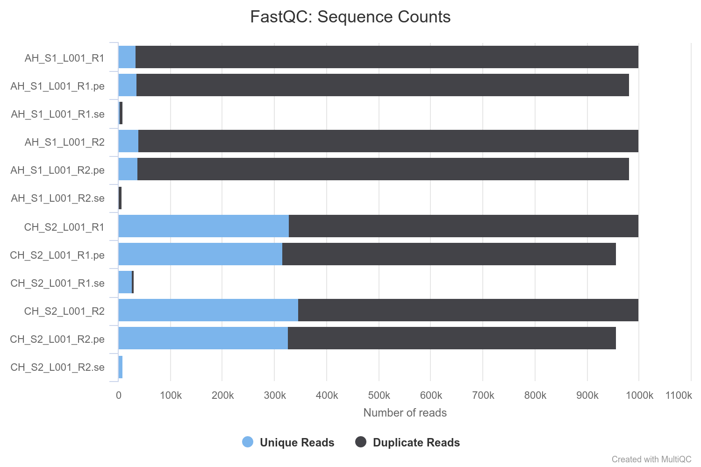
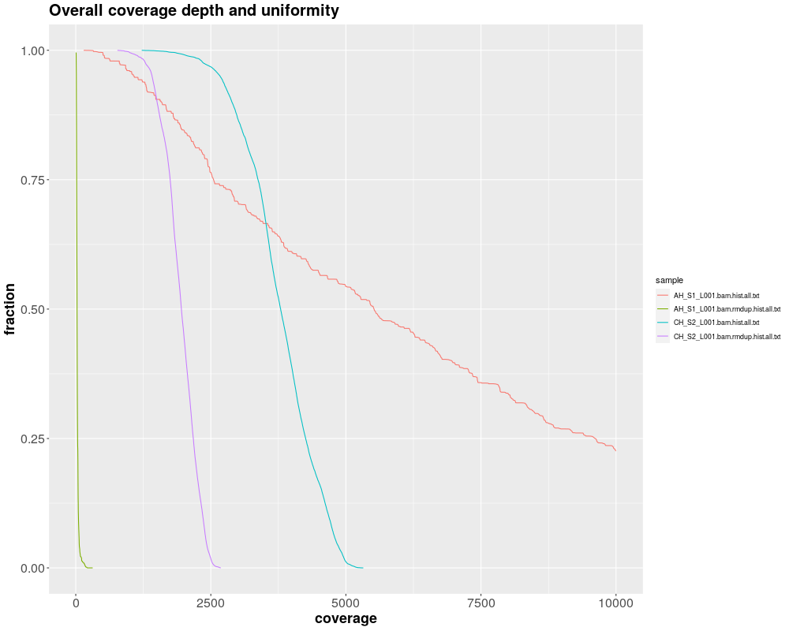

```{r setup, include=FALSE}
knitr::opts_chunk$set(echo = TRUE)
```

##Task assignment

The complete task should contain the following files <br />
1, readme.txt <br />
2, AH_S1_L001_R1.fastq.gz <br />
3, AH_S1_L001_R2.fastq.gz <br />
4, AH_S1_target.txt <br />
5, CH_S2_L001_R1.fastq.gz <br />
6, CH_S2_L001_R2.fastq.gz <br />
7, CH_S2_target.txt <br />

The two datasets (S1 and S2) of paired-end short reads are from the SAME human DNA NGS library for clinical diagnosis of solid tumor. They were obtained through two different target sequencing approaches with corresponding target region file provided (hg19). Please evaluate their performances as much as you can and compile your results into a task report to submit back. <br />
1, the task has to be finished in one week by yourself <br />
2, if the two approaches are wrapped into two commercial NGS products, which one would you chose in your lab for clinical diagnose? And why? <br />

##Bionformatics pipelne description
1) setting conda environment <br />
2) QC of raw reads (fastQC, multiqc) <br />
3) reads trimming (Trimmomatic) <br />
4) QC of trimmed reads (fastQC, multiqc) <br />
5) read mapping onto hg19 genome (bwa mem) <br />
6) reads sorting/filtering (samtools) <br />
7) marking/removing duplicates (picard MarkDuplicatesWithMateCigar) <br />
8) coverage reports (bedtools, picard calculate TargetedPcrMetrics) <br />
9) variant calling (VarDict) <br />
10) variant annotation (ensembl vep) <br />
11) vcf2maf (vcf2maf.pl) <br />
12) variant summary (maftools) <br />
13) visualization in R <br />
14) report generated using R markdown <br />


##Performance evaluation approaches

The performance on two panels was evaluated based on: <br />
1) entry analysis of input fastq and adaptor/quality trimming <br />
2) analysis of coverage was based primarily on its uniformity, detph, on/off target, duplication rates) <br />
3) variant detection performance <br />

###Entry analysis of input fastq and trimming  <br />
The input data of both panels were, from the point of raw reads, of good quality. 
In order to remove possible presence of Illumina adapters, singletons, short reads and low quality ends, 
trimming tool Trimmomatic was used. Only the high quality pair-end reads were used for further analysis. <br /> 

Importantly, initial sequence counts for both panel were 2M of raw reads; after trimming, more than 95% of the hiqh quality reads remained in both cases. Both panels consist of high amount of duplicate reads (AH_S1 has more than 95%; CH_S2 has 65% of duplicates). 
For details, see Figure 1. <br /> 

Waste majority of reads were 150 bp long and had per sequence quality higher than 30. 
The percentage of singleton reads was in all cases lower 5%. In the case of panel AH_S1, R2 singletons harboured a significant portion of primer dimers which were detected by fastQC as adapters.
More details about raw and trimmed fastq files are available in the form of MultiQC report, section "fastQC":
<file:./multiqc/multiqc_report.html#fastqc>  <br />


{width=80%}

<br /> 

###Analysis of coverage
Only pair-end reads were mapped onto the reference genome hg19 using BWA MEM. After the mapping, alignments were manually inspected using IGV. Based on the character of alignment and previous knowledge about duplications rates, I have assumed that AH_S1 is an amplicon based panel and CH_S2 panel is capture-based. Considering panel size and overall design, percentage of duplicates seems to be acceptable.

For further evaluation, read duplicates were marked and removed using picard "MarkDuplicatesWithMateCigar" which is supposed to be more precise than standard "MarkDuplicates"" algorithm. 
Next, histogram files generated using bedtools were visualized.

Figure 2 is describing coverage depth and uniformity for both panels with and without duplicates. 
As we can observe, amplicon panel AH_S1 is based only on PCR duplicates and logically can not be further assessed with having them removed. AH_S1 panel has also very diverse coverage (fraction of depth > 10000 is not visualized). On the other site, target capture panel CH_S2 has uniform coverage before and also after duplicates removal.





<br /> 
Next results are based mainly on picard coverage metrics. For analysis of panels with duplicates, CollectTargetedPcrMetrics were preferred over HsMetrics because HSmetrics removes duplicates which is undesirable; and to my opinion, only one software approach should be used to compare 2 panels based on the same metrics.

Using results from picard PER_TARGET_COVERAGE reports, 3 graphs describing mean per target coverage for panels AH_S1, CH_S2 with and without duplicates were generated - Figure 3.
As previously suggested on the "Coverage depth and uniformity" graph, AH_S1 has very diverse coverage across the targets in comparison to CH_S2.

Basic summary for the data plotted in Figure 3 are provided in Table 1. Except better coverage uniformity, CH_S2, panel has also higher minimum when assuming average coverage per target.


<br /> 

| Panel                                  | mean*  | min*   | max coverage* | SD*    |
|----------------------------------------|--------|--------|---------------|--------|
| AH_S1                                  | 7322.7 | 438.7  | 42839.8       | 7329.6 |
| CH_S2                                  | 3623.9 | 1552.9 | 4933.7        | 630    |
| CH_S2 dedup                            | 1877.7 | 939.1  | 2496.9        | 301.4  |
| * based on mean values for each target |        |        |               |        |

**Table 1** - summary of the metrics for average per target coverage

<br /> 
Next, Table 2, is based on picard CollectTargetedPcrMetrics default output and provides insight into different descriptive statistics. AH_S1 dominates over CH_S2 in the target size and in the number of on-target bases. Percentage of off-target bases is higher in CH_S2 sample which could be an advantage in the case of considering detected variants behind the targets. CH_S2 is also better in coverage - low and high coverage of AH_S1 can cause troubles during variant detection and in the worse scenario cause FNs or need for additional sequencing run cost. Percentage of regions covered > 1000 (based on bedtools coverage) is also better in CH_S2.
For additional detail, see MultiQC report, section "picard": <file:./multiqc/multiqc_report.html#picard>


| Panel       | num of targets | target size | % off target | coverage > 1000 (bp) | max coverage* | min coverage* | num of bases* | GC dropout |
|-------------|----------------|-------------|--------------|----------------------|---------------|---------------|---------------|------------|
| AH_S1       | 230            | 23498       | 0.043721     | 0.959                | 89417         | 139           | 190309801     | 2.18298    |
| CH_S2       | 122            | 21282       | 0.210097     | 1                    | 5202          | 1216          | 80298172      | 1.235663   |
| CH_S2 dedup | 122            | 21282       | 0.278166     | 0.996                | 2583          | 768           | 41167025      | 0.812248   |
| * on target |                |             |              |                      |               |               |               |            |


**Table 2** - summary of the metrics from picard CollectTargetedPcrMetrics <br /> 
<br /> 

###Evaluation of variant detection
Another perspective of evaluating sequencing panel performance is a variant detection. In case of AH_S1 was variant calling done on the bam file with duplicates; in case of CH_S2, bam with removed duplicates was used. To asses variant calling objectively, it was done in the regions common for both of the panels (intersect of AH_S1 and CH_S2 targets). CH_S2 panel has detected 2 more missense mutations which could be causative (driver) mutations, for details, see Table 3.

| sample | silent  | missense | In_Frame_Del | Frame_Shift_Del |
|--------|---------|----------|--------------|-----------------|
| AH_S1  | 10      | 8        | 1            | 1               |
| CH_S2  | 10      | 10       | 1            | 1               |

**Table 3** - summary of detected variants in common regions 
<br /> 

<br /> 

To better assess variant calling performance, reference data with known mutations would be ideal input (NIST, GIAB, SEQC2).

When considering all the regions (not only intersect), AH_S1 panel has more detected mutations, see Table 4.


| Tumor_Sample_Barcode | 3'UTR | Frame_Shift_Del | Frame_Shift_Ins | In_Frame_Del | Intron | Missense_Mutation | Silent | Splice_Region | total |
|----------------------|-------|-----------------|-----------------|--------------|--------|-------------------|--------|---------------|-------|
| AH_S1                | 2     | 2               | 1               | 2            | 10     | 17                | 15     | 1             | 50    |
| CH_S2                | 1     | 2               | 1               | 1            | 3      | 12                | 16     | 1             | 37    |


**Table 4** - summary of detected variants in panel-specific regions<br /> 

<br /> 

##Overall summary 
**Capture based panel CH_S2** <br /> 
- better coverage uniformity<br /> 
- higher minimal coverage<br /> 
- lower % of off-target bases<br /> 
- more mutations detected in common (shared by boths panels) regions<br /> 
- higher off-target coverage could be also an advantage in some cases discussed above<br /> 
- lower GC dropout<br /> 

These factors provide lower analysis cost, high reliability and reproducibility.
In general, target capture panels also allow easy integration of UMIs allowing more sensitive and precise variants. Even a capture panel without UMIs allows duplicates' removal and thus more precise VAF estimation. This is especially important for the analysis of cancer samples.


**Amplicon based panel AH_S1**<br /> 
- larger target size
- overall higher count of detected mutations

#Choice for clinical diagnostics
Based on the facts described in the previous paragraph, my choice would be the capture based panel CH_S2.


